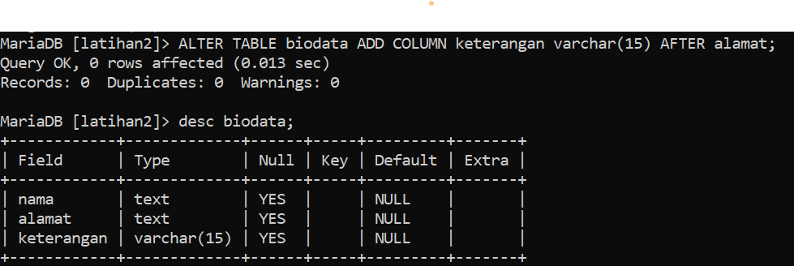

# Petemuan5
SQL_DDL
# Tugas Pratikum(Pertemuan ke-5)
## 1. Buat sebuah database dengan nama latihan2!
Pertama- tama kita masukkan code seperti ini:

kemudian baru kita create database:

dan jangan lupa untuk pakai perintah USE latihan2:

## 2. Buat sebuah tabel dengan nama biodata (nama, alamat) didalam database latihan2!

## 3. Tambahkan sebuah kolom keterangan (varchar 15), sebagai kolom terakhir!

## 4. Tambahkan kolom id (int 11) di awal (sebagai kolom pertama)!

## 5. Sisipkan sebuah kolom dengan nama phone (varchar 15) setelah kolom alamat!

## 6. Ubah tipe data kolom id menjadi char(11)!

## 7. Ubah nama kolom phone menjadi hp (varchar 20)!

## 8. Tambahkan kolom email setelah kolom hp

## 9. Hapus kolom keterangan dari tabel!

## 10. Ganti nama tabel menjadi data_mahasiswa!

## 11. Ganti nama field id menjadi nim!

## 12. Jadikan nim sebagai PRIMARY KEY!

## 13. Jadikan kolom email sebagai UNIQUE KEY

# Tulis semua perintah-perintah SQL percobaan di atas beserta outputnya!
sudah tertera diatas.
# Apa maksud dari int (11)?
Maksud tersebut adalah sebuah type data sedangkang "int" adalah singkatan dari interger dan "11" adalah panjangnya.
# Ketika kita melihat struktur tabel dengan perintah desc, ada kolom Null yang berisi Yes dan No. Apa maksudnya ?
Pada kolom NULL terdapat YES or NO, singkatnya jikalau dia YES berarti datanya bisa diisi, sedangkan yang NO dia tidak bisa diisi datanya.
# Buat laporan praktikum beserta langkah-langkah yang dilakukan dalam bentuk tutorial beserta screenshot outputnya (point 1)
